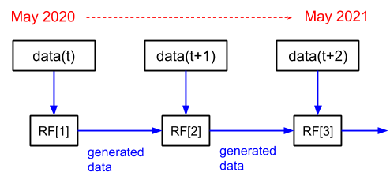
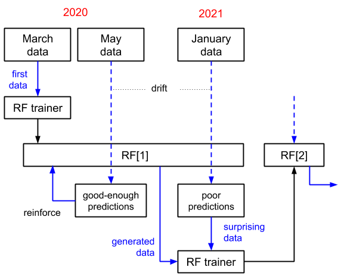
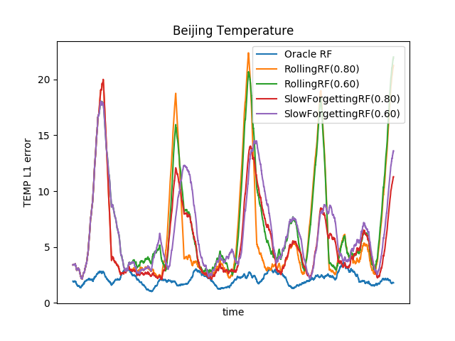
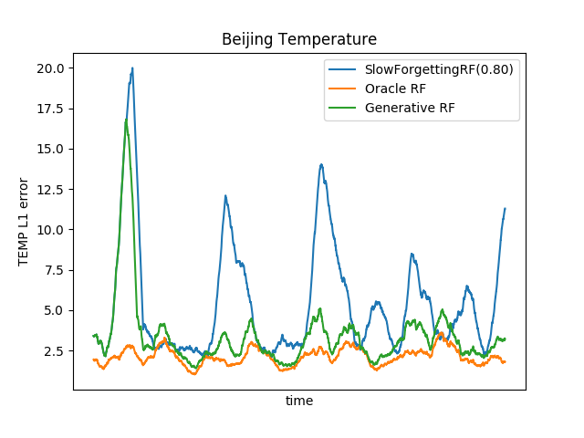
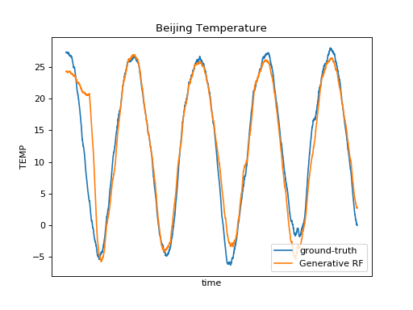
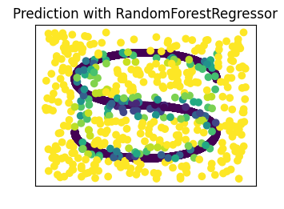
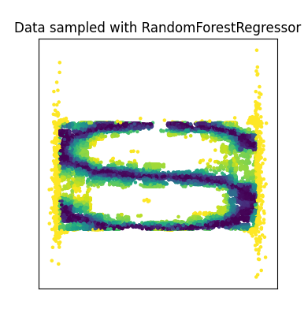

GenerativeRF is a library that can transform your ordinary random forest into a feature generator.

## Implementations

- [Python, on top of scikit-learn](./python)
- [GO, on top of GoLearn](./golearn)

## Motivation

GenerativeRF's primary purpose is [generative replay](https://www.nature.com/articles/s41467-020-17866-2), a common way of avoiding [catastrophic forgetting](https://en.wikipedia.org/wiki/Catastrophic_interference) in [continual learning](https://en.wikipedia.org/wiki/Online_machine_learning) settings.

Generative replay is one of the only approaches that deal with catastrophic forgetting at *fixed* capacity.
That is, without growing the model nor storing replay data.
If you take advantage of generative replay to train new models from scratch, as opposed to adapting an existing model, generative replay enables the system to truly learn completely new things/classes. In other words, it goes beyond simply tweaking some parameters to mitigate [data drift](https://en.wikipedia.org/wiki/Concept_drift).

<p align="center">
  
</p>

Below is a more detailed view on a scenario where the model is rebuilt if its performance drops, and reinforced otherwise.
This is how I would implement continual learning, though the library is not committed to any particular process.

<p align="center">
  
</p>


# Tests

Those benchmarks evaluate GenerativeRF's success in predicting the temperatures from [Beijing PM2.5 Data Set](https://archive.ics.uci.edu/ml/datasets/Beijing+PM2.5+Data). This is a multivariate time series problem that presents a challenge to algorithms that can't learn seasonal trends in an online fashion.

<p align="center">
  
</p>

This graph shows a few baselines:
- Oracle RF has access to the entire dataset. i.e. it is *not* an online learning algorithm.
- RollingRF(0.8) replaces 20% of the oldest trees with new trees trained from new data.
- SlowForgettingRF(0.8) randomly replaces 20% of the trees with new trees trained from new data.

(in more familiar terms, RollingRF and SlowForgettingRF are possible implementations of scikit's `partial_fit` interface)

Both RollingRF and SlowForgettingRF underperform in my benchmarks.
SlowForgettingRF is capable of learning new things from new data, and doesn't quickly forget what it has previously learned, but the eldest trees drag the accuracy down when presented with data too recent for them. Put differently, such trees are unable to detect if the input is out-of-distribution, and therefore cannot avoid pushing predictions towards the wrong direction.

Now, let's compare these baselines with GenerativeRF.

<p align="center">
  
</p>

Another view of the problem, comparing with the ground-truth temperatures.

<p align="center">
  
</p>

# Under the hood

The generation algorithm browses every tree from root to leaf like you would do to search an element in a binary search tree.
At each node split, it produces a value sampled in the vicinity of the node's threshold.
During the training and reinforcement stages, some information about the balance around the thresholds is kept to help with generating unbiased data later on.
For example, if the average temperature in the training data is 15°C, a random forest trained from generated data is expected to predict temperatures that also average to 15°C.

GenerativeRF is not a probabilistic generative model like, say, VAEs.
It generates data near the decision boundary of the decision trees and nowhere else, so the data generated by GenerativeRF is not sampled from an approximation of the training data distribution.
This turns out to be effective for training new, accurate random forests though, at least on the datasets I have tested the algorithm on.

As targets/labels are not involved in the generation process, GenerativeRF readily works for both regression and classification.
The algorithm would be more accurate if it were taking into account the distribution of the target in each leaf.
In practice, however, since by design the variance/entropy of the target is near zero at the leaf level, leaves provide little information and it is not worth customizing the algorithm for either classification or regression.

The method used by GenerativeRF has a lot in common with [uncertainty sampling](https://en.wikipedia.org/wiki/Active_learning_(machine_learning)), so I would not be surprised if it were to perform well in an [active learning](https://en.wikipedia.org/wiki/Active_learning_(machine_learning)) setting.
Another area where it could be useful is [knowledge distillation](https://en.wikipedia.org/wiki/Knowledge_distillation), but I wouldn't put my money on it.


### Pseudo-code

```JavaScript
function OnlineLearning(streamer, generator) {
  forest = BootstrapRandomForest()
  for batch, y in streamer.Poll() {
    if DataDrifted(batch, y) {
      // re-training
      gx, gy, gw = Generate(generator, forest, numSamples=20000)
      batch = Concat(batch, gx)
      targets = Concat(y, gy)
      weights = Concat(ones(size(y)), gw * ones(20000))
      forest = TrainRandomForest(batch, targets, weights)
      Reinforce(generator, gx, forest, weight=gw)
    }
    Reinforce(generator, batch, forest, weight=1)
    UpdateMoments(generator, batch)
  }
}
```

```JavaScript
function Reinforce(generator, data, forest, weight) {
  // this is to calculate the transition probabilities required to
  // guide the random walks on the trees
  for row in Rows(data) {
    for tree in forest {
      for node in forest.DecisionPath(row) {
        generator.count[node] += weight
      }
    }
  }
}
```

```JavaScript
function UpdateMoments(generator, data, forest) {
  // this is for generating the default feature values:
  generator.variance.Update(data)
  generator.mean.Update(data)

  // this is to calculate the sample weights of the generated rows:
  generator.total += NumRows(data)
}
```

```JavaScript
function Generate(generator, forest, numSamples) {
  // initialize the generated features with default values
  features = Normal(generator.mean, generator.variance, size=numSamples)
  // reminder: trees don't utilize all the features,
  // hence the need for default values

  // sample weights
  weight = generator.total / numSamples

  // number of samples we will generate out of each tree
  samplesPerTree = numSamples / size(forest)

  // random walk
  i = 0
  for tree in forest {
    repeat samplesPerTree times {
      for (featureName, value) in RandomWalk(generator, tree.root) {
        features[featureName, i] = val
      }
      i = 1
    }
  }

  y = forest.predict(features)

  return features, y, weight
}
```

```JavaScript
function RandomWalk(generator, node) {
  values = Map()
  while NotLeaf(node) {
    nudge = 0.001 * Normal(generator.variance[node.featureName])
    if Rand() < generator.LeftProbability(node) {
      value = node.threshold - nudge
      node = node.left
    } else {
      value = node.threshold + nudge
      node = node.right
    }
    values[node.featureName] = value
  }
  return values
}
```


# Toy dataset

s_curve data learned by a random forest:
<p align="center">
  
</p>

(colors represent the target)

Data generated by the same random forest:

<p align="center">
  
</p>
